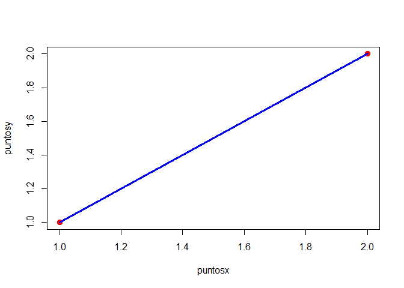

<!-- README.md is generated from README.Rmd. Please edit that file -->

# geoanaliticaP

<!-- badges: start -->

<!-- badges: end -->

El objetivo de geoanaliticaP es crear una prueba y aprender a crear
librerias en R

## Installation

Puedes instalar la libreria desde

``` r
devtools::install_github("frandepy2/geonaliticaP")
```

## Example

This is a basic example which shows you how to solve a common problem:

``` r
library(geoanaliticaP)

puntoMedio(c(1,1),c(2,2))
#> [1] 1.5 1.5
```

Puedes graficar segmentos como por ejemplo, for example:


